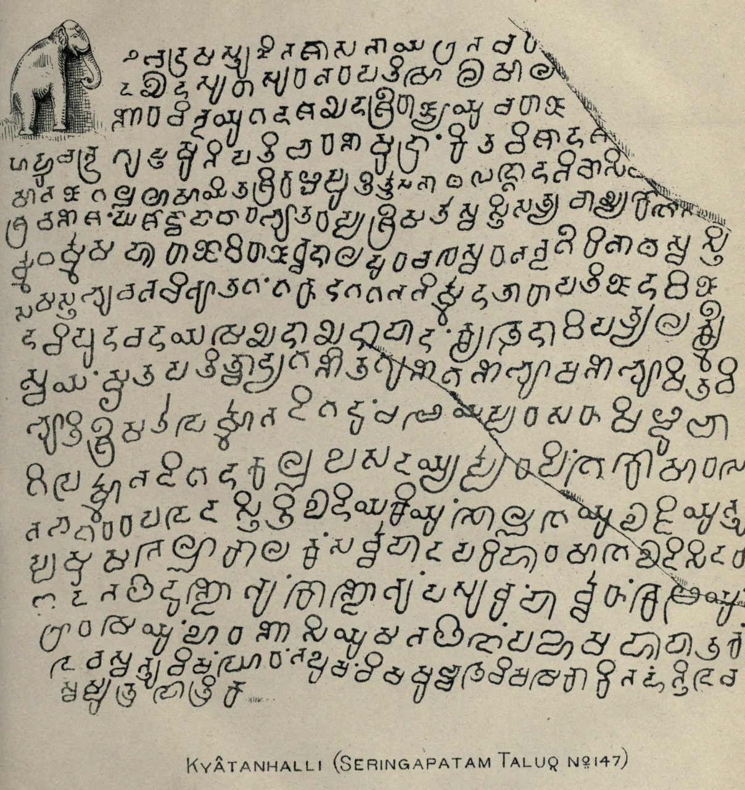
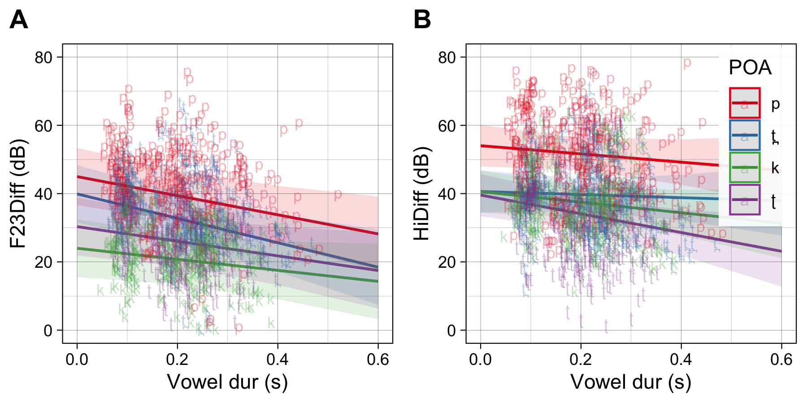

# **Debuccalization in Kannada**

[SAP Lab](https://saplabyork.github.io)

{width=50%}

### Background
  
The current project is one of 2 or 3 studies I'm working on having to do with solving the problem of debuccalization in Old Kannada, where Old Tamil p&rarr;h. The oldest documented occurrance of this change is found in a 10th C. inscription from Srirangapatnam [910 AD: "...lōkakke hōhan" (for *pōpan*?)] (Narasimhia, 1941 p. 13; *Epigraphia Carnatica III, Seringapatam Taluq, 134*)

The question is *why* this happens. There are two hypotheses about the origin of this change:

1) Subbaiya, K.V. (*Indian Antiquary*, 1909, p.197) suggests that the change results from contact with Marathi, which sees a similar (though limited) change of bh > h. But there are problems with this hypothesis--we would expect evidence of the change to be geographically predictable, but this is not what we see. The first evidence of change is in the southern Kannada-speaking region.

2) The other, perhaps related explanation, is a phonological one proposed by Tuttle, E.H. (1929) (*American Journal of Philology*, 50, 2, pp.138-155). Tuttle suggests that the change from p > h is related to a another change occurring in Kannada around the same time (9th C), v > b. The argument runs that there is phonological *pressure* on p to be made more distinct from the newly introduced b. As the production of p and b are very similar (especially in onsets), p becomes aspirated as [$p^h$]. From aspirated p, Tuttle suggests a path to [f] then [h].

The typical path for this sort of debuccalization change is that p&rarr;f&rarr;h. The problem is that there is no evidence of an f stage in the change in Kannada. We might expect some sort of accommodation of $p^h$ in the inscriptional evidence, but this is not what we find, rather simply a whole sale replacement of p with h. Of course absence of evidence is not evidence of absence, but I want to propose an alternative explanation.

My theory is that there is internal phonetic/perceptual pressure affecting this change. Narayan (2022/23) shows that the burst characteristics of p in Tamil, which does not contrast voicing in word-initial position and has very short VOT, are low amplitude (relative to the amplitude of the vowel). 

{height=75% width=75%}

My hypothesis is that low amplitude bursts are potentially not heard and confusable with h. The thinking is that Old Kannada, which already had h- (from Sanskrit borrowings), is confusable with low amplitude p bursts. 
\
\

## The studies

### Phonological pressure

The **Phonological pressure** study directly examines Tuttle's claim that v > b forces p > [$p^h$] (which ultimately leads to debuccalization). In this task, Tamil-speaking subjects learn a new word for a nonsense lexical item that results in a minimal pair with a Tamil word. The new word starts with [b-] (which is really the p-initial Tamil word with maniuplated VOT and F0 characteristics). For example: [baḻam] New word ~ [paḻam] "fruit". Subjects are then asked to produce both words as if instructing a new Tamil speaker. They do this in two noise conditions, hopefully inducing clear speech behavior.

* If subjects behave according to Tuttle, we would expect them to disambiguate the new minimal pair by aspirating (to some degree relative to baseline productions) their [p-] native Tamil word. [I do not think this will happen!]

* The other possibility is the speakers "strengthen" the new word by producing it with longer negative VOT. [I think this will happen.]

### POA Salience

Provided speakers do not aspirate their [p-], my hypothesis is that there is internal acoustic-perceptual pressure which affects the debuccalization, namely, that [p-] bursts are quiet enough to be misheard. The second experiment compares the discriminability of various place-of-articulation contrasts from Tamil: p, t̪ ,ʈ,k,and h. We are specifically targeting the discriminability of p vs. h against t̪ ,ʈ,k vs. h.

We will do an AX task for each pair of places of articulation in three SNR conditions. The prediction is the p-h will have a SDT d' score lower than t̪-h and ʈ-h and k-h, i.e., p-h is less discriminable than other combinations as evidenced by a low d' in noise conditions.

### Confusion
Tamil confusion matrices in noise.
See Cutler et al. (2004) for confusion matrix methods.